# 🎨 Colorfly

🔗 **Demo online:**
https://acostaludmila.github.io/ProyectoM1_AcostaLudmila/

Colorfly es una aplicación web desarrollada con HTML, CSS y JavaScript que permite generar paletas de colores aleatorias mediante una interfaz inspirada en manchas de pintura artísticas.

Cada color se presenta como una figura orgánica única y puede visualizarse en diferentes formatos de color, copiarse al portapapeles o bloquearse para conservarlo al generar nuevas combinaciones.

## 🚀 Funcionalidades

* Generación aleatoria de paletas de colores.
* Selección de 6, 8 o 9 colores por paleta.
* Visualización de colores en formato:

  * HEX
  * RGB
  * HSL
* Copia rápida de códigos de color al portapapeles.
* Bloqueo de colores individuales para mantenerlos entre generaciones.
* Persistencia de datos mediante Local Storage.
* Manchas de pintura con formas y tamaños aleatorios.
* Animaciones y efectos visuales.
* Diseño responsive adaptable a distintos dispositivos.
* Navegación accesible mediante teclado.

## 🛠️ Tecnologías utilizadas

* HTML5
* CSS3
* JavaScript (Vanilla JS)
* Local Storage API
* Git
* GitHub
* GitHub Pages

## 🖼️ Capturas y demostraciones

### Vista principal
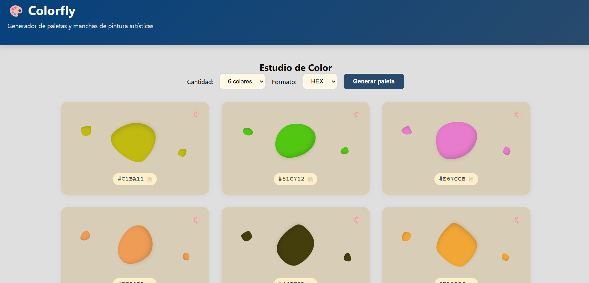

### Generación de paletas
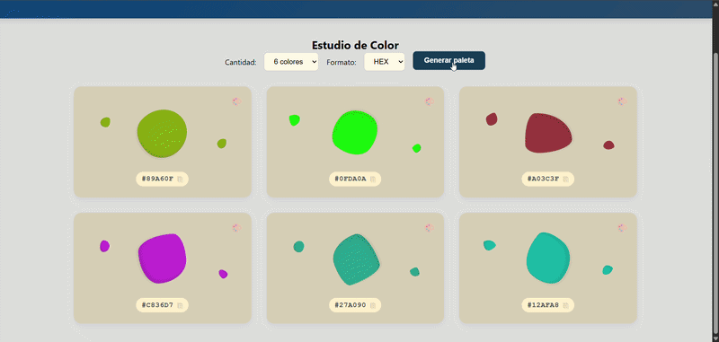

### Bloqueo de colores
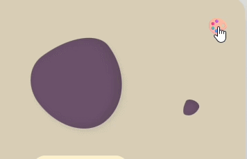

## 🎯 Objetivo del proyecto

Este proyecto fue desarrollado para poner en práctica conceptos fundamentales de desarrollo web, incluyendo:

* Manipulación del DOM.
* Manejo de eventos.
* Almacenamiento local.
* Diseño responsive.
* Accesibilidad web.
* Generación dinámica de contenido.

## ▶️ Cómo utilizarlo

1. Acceder a la versión online mediante el enlace disponible al inicio de este README.

**O bien:**

1. Clonar o descargar el repositorio.
2. Abrir la carpeta del proyecto.
3. Abrir el archivo `index.html` en el navegador.
4. Generar y personalizar paletas de colores utilizando los controles disponibles.

## 🤖 Documentación del uso de IA

Esta sección contiene evidencias del uso de herramientas de inteligencia artificial durante el proceso de desarrollo del proyecto.
**Prompt 1:**
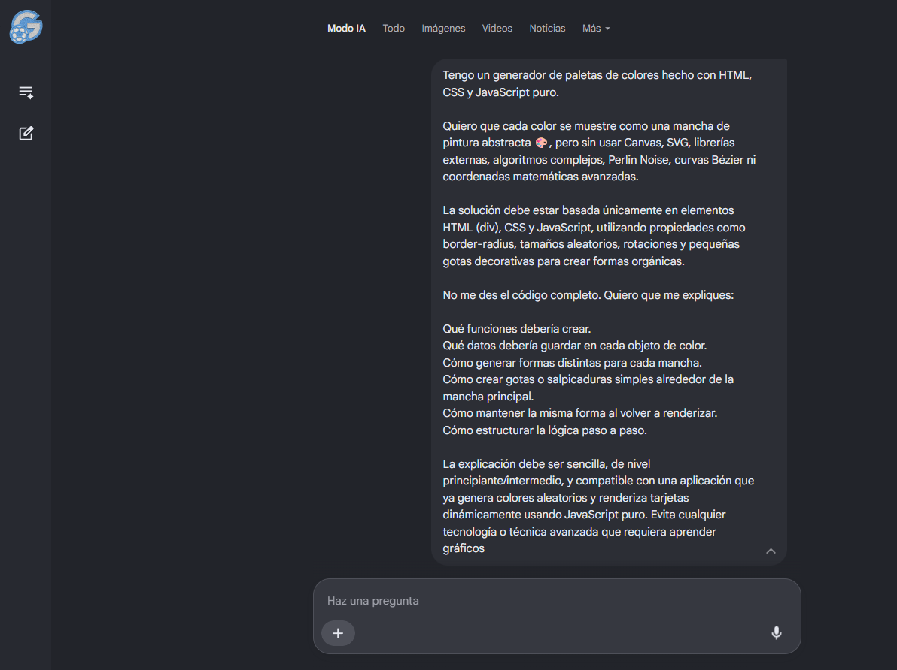

**Respuesta:**
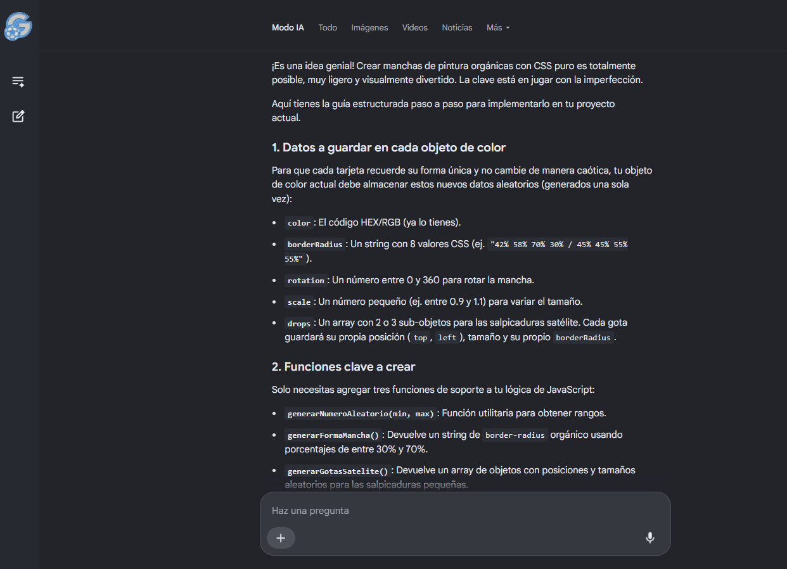
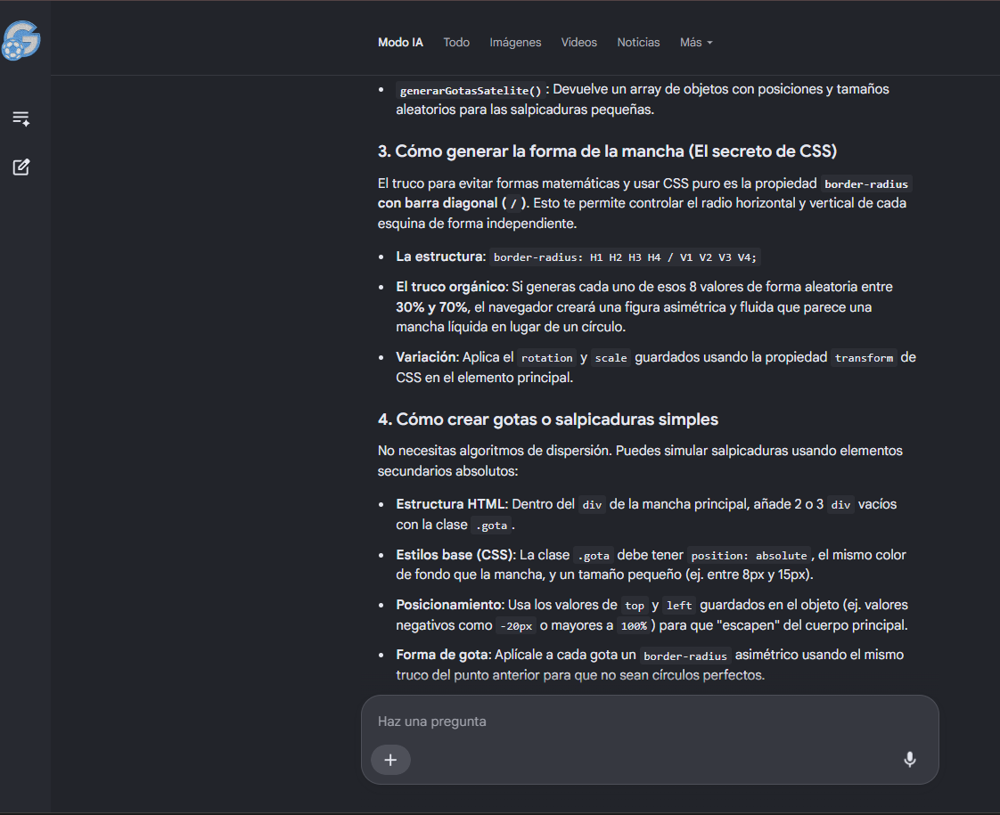
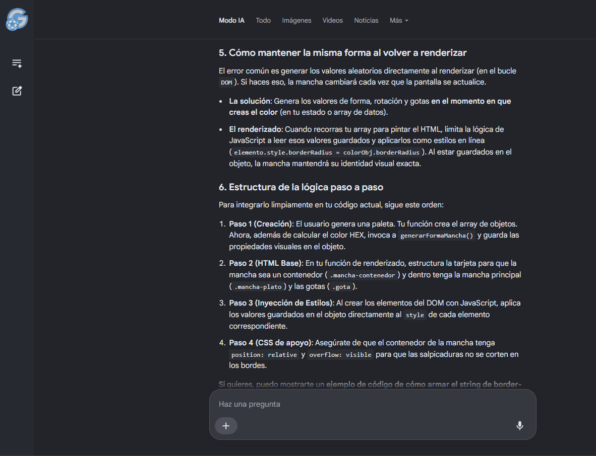

**Prompt 2:**
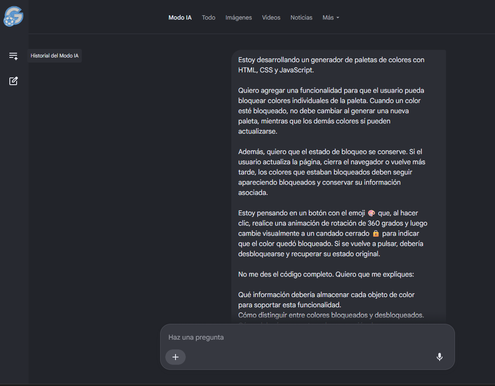

**Respuesta:**
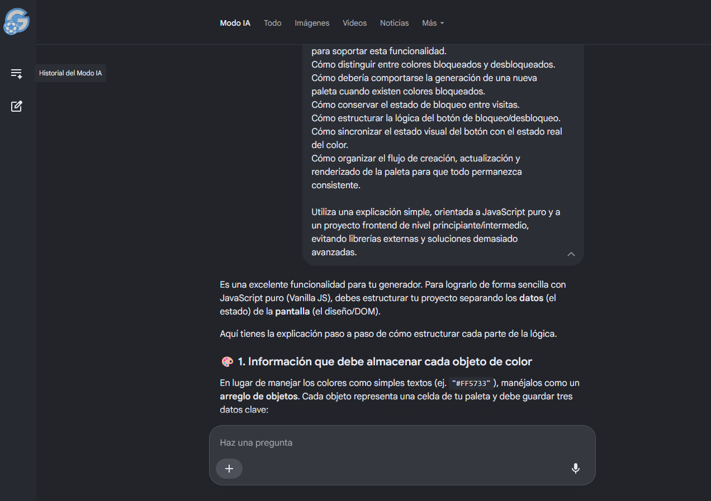
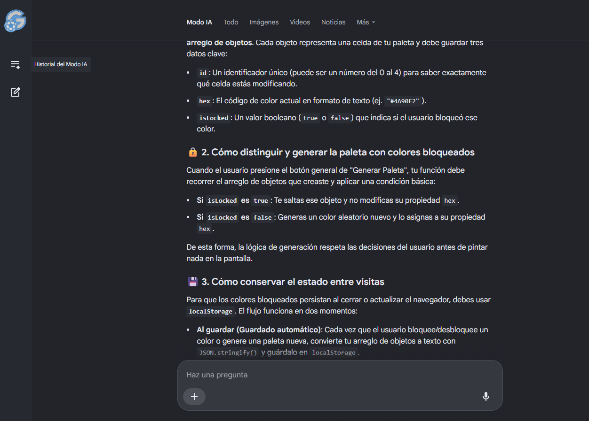
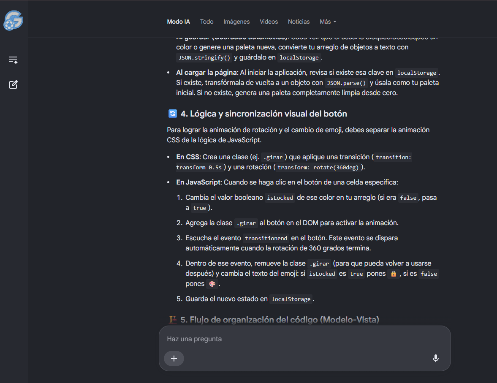
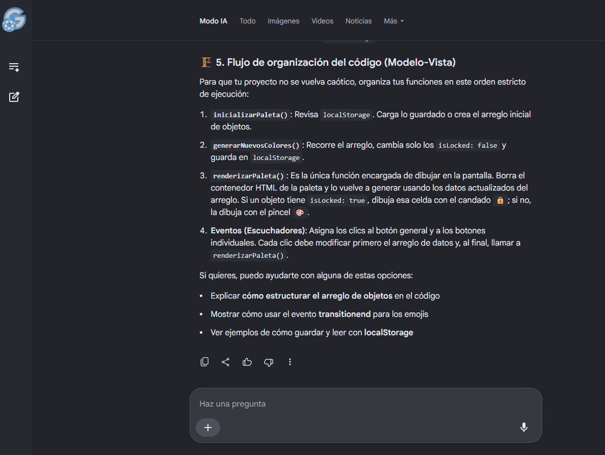
## 👩‍💻 Autor

**Ludmila Estefania Acosta**

**Proyecto Integrador M1**
